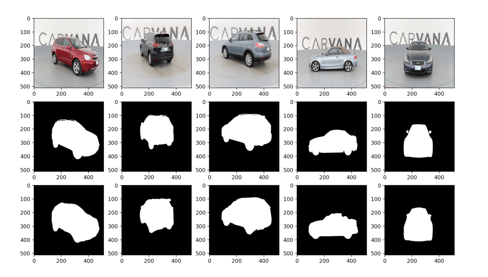
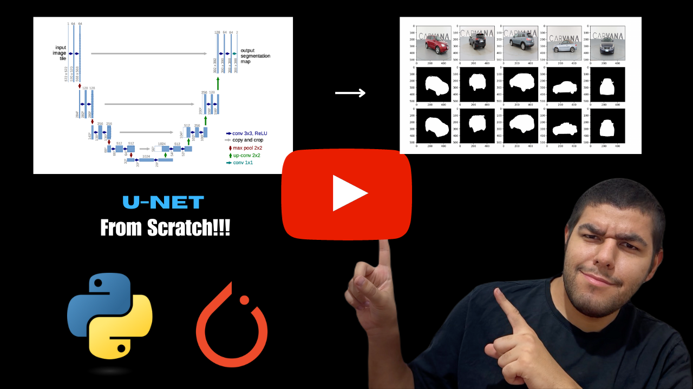

## Minimalistic U-Net Implementation With PyTorch



This repository contains minimalistic implementation of U-Net using PyTorch. Implementation has tested using [Carvana Image Masking Challenge](https://www.kaggle.com/c/carvana-image-masking-challenge) by Kaggle.

Above example demonstrates original images, original masks and predicted masks row by row.

### YouTube Tutorial
This repository also contains a corresponding YouTube tutorial with the title **Implement and Train U-NET From Scratch for Image Segmentation - PyTorch**

[](https://www.youtube.com/watch?v=HS3Q_90hnDg&t=10s)

### Project Structure
Project structured as follows:

```
.
└── src/
    ├── carvana_dataset.py
    ├── unet.py
    ├── unet_parts.py
    ├── main.py
    ├── inference.py
    ├── data/
    │   ├── manual_test
    │   ├── manual_test_mask
    │   ├── train
    │   └── train_mask
    └── models/
```

`carvana_dataset.py` creates the PyTorch dataset. `unet_parts.py` contains the building blocks for the U-Net. `unet.py` is the file that contains the U-Net architecture. `main.py` file contains the training loop. `inference.py` contains necessary functions to easly run inference for single and multiple images.

`models/` directory is to save and store the trained models.

`data/` directory contains the data you're going to train on. `train/` contains images and `train_mask/` contains masks for the images. `manual_test/` and `manual_test_mask/` are optional directories for showcasing the inference.

### Pre-Trained Model
You can download a sample pre-trained model from [here](https://drive.google.com/file/d/1evei4cZkBlpoq70iapItN1ojldIXSOc2/view?usp=sharing). Put the model into the `models/` directory.

### Inference
`inference.py` file provides two functions for inference. If you want to run prediction on multiple images, you must use `pred_show_image_grid()` function by giving your data path, model path and device as arguments.

If you want to run the prediction on single image, you must use `single-image-inference()` function by giving image path, model path and your device as arguments. 

You can view a sample use inside `inference.py`.

### Training
In order to train the model you must run the command `python main.py`. File has hyperparameters of `LEARNING_RATE`, `BATCH_SIZE` and `EPOCHS`. You can change them as you like.

You must give your data directory and the directory you want to save your model to `DATA_PATH` and `MODEL_SAVE_PATH` variables in the `main.py` file.

By the end of the training your model will be saved into the `MODEL_SAVE_PATH`.
